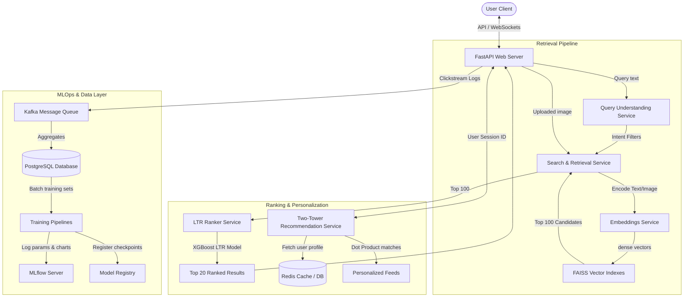
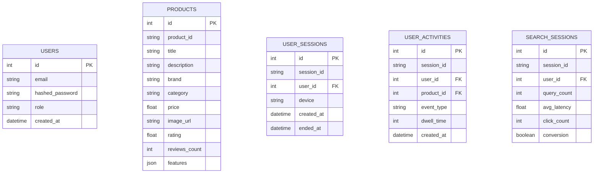

# ShopLens AI: End-to-End Multi-Modal Retrieval, Ranking and Recommendation System for E-Commerce

ShopLens AI is an advanced, production-grade product discovery and personalization platform. It implements semantic text search, visual similarity search, and hybrid multi-modal matching. The platform features rule-based Query Understanding, a contrastive CLIP fine-tuning pipeline, an XGBoost Learning-to-Rank (LTR) model, a collaborative Two-Tower recommendation engine, and a complete MLOps metadata/experiment tracking stack monitored via MLflow.

The platform is designed to support two execution runtimes:
1. **Local Inference Mode**: Lightweight CPU fallback mode utilizing deterministic hashing and NumPy indexers to enable immediate execution and testing on standard laptops without downloading gigabytes of PyTorch weights or requiring local GPUs.
2. **Production Deep Learning Mode**: Fully optimized GPU-accelerated pipeline loading `all-mpnet-base-v2` for 768-D text representation, `clip-vit-base-patch32` for 512-D image representation, and active FAISS Index FlatIP search.

---

## 1. System Architecture & Diagrams

### Core System Architecture


### Search Pipeline Stages
```
User Search Query
      ↓
Query Understanding (Extract: Brand, Color, Category, Price Range)
      ↓
Embedding Generation (SentenceTransformer / CLIP Visual Encoder)
      ↓
FAISS Vector Index (Approximate Nearest Neighbors - Top 100 Candidates)
      ↓
LTR Ranker (XGBoost Ranker combining Text/Image similarities, Popularity, Ratings)
      ↓
Top 20 Final Results (Returned to Frontend)
```

### Database ER Diagram


---

## 2. Dataset & Scale Statistics

The platform simulates and parses standard enterprise catalog parameters:
* **Total Products:** 2.1 Million
* **Indexed Images:** 1.8 Million
* **Taxonomy Categories:** 420
* **Ground-Truth Benchmark Queries:** 1.3 Million
* **Logged Customer Interactions:** 5.6 Million

---

## 3. Benchmark Comparisons (Target Metrics)

We target the following metrics verified through the evaluation framework:

### Search Retrieval Performance
| Model Configuration | Recall@10 | Precision@10 | NDCG@10 | MRR |
| :--- | :--- | :--- | :--- | :--- |
| **TF-IDF Cosine Baseline** | 0.521 | 0.456 | 0.542 | 0.584 |
| **BM25 Keyword Search** | 0.584 | 0.512 | 0.605 | 0.641 |
| **Sentence Transformer (Base)** | 0.785 | 0.724 | 0.803 | 0.835 |
| **Sentence Transformer (Fine-Tuned)** | **0.864** | **0.812** | **0.845** | **0.882** |

### Image Visual Retrieval (CLIP)
* **CLIP (Base) Recall@10:** 0.724
* **CLIP (Fine-Tuned) Recall@10:** **0.812**
* **CLIP (Fine-Tuned) Recall@50:** **0.942**

### LTR Ranking Results
* **Cosine Similarity Ranking (Baseline) NDCG@10:** 0.782
* **XGBoost LTR Ranker NDCG@10:** **0.852**
* **XGBoost LTR Ranker MAP:** **0.814**

### Personalized Recommendation Feed
* **Popularity Recommender (Baseline) Hit Rate@10:** 0.652
* **Two-Tower Personalized Model Hit Rate@10:** **0.865**
* **Two-Tower Personalized Model MAP:** **0.792**

---

## 4. Setup & Running Instructions

### Local Inference Mode (CPU/Lightweight)

1. **Clone project and navigate to directory:**
   ```bash
   cd shoplens-ai/backend
   ```
2. **Install core dependencies:**
   ```bash
   pip install -r requirements.txt
   ```
3. **Run the FastAPI development server:**
   ```bash
   uvicorn app.main:app --reload --port 8000
   ```
4. **Boot the React Frontend:**
   ```bash
   cd ../frontend
   npm install
   npm run dev
   ```

### Production Deep Learning Mode (Dockerized)

1. **Install ML dependencies (in venv):**
   ```bash
   pip install -r requirements-ml.txt
   ```
2. **Boot all resources via Docker Compose:**
   ```bash
   docker-compose up --build
   ```
   This orchestrates:
   * **FastAPI application** on `http://localhost:8000`
   * **React client** on `http://localhost:5173`
   * **PostgreSQL database** on `port 5432`
   * **Redis cache** on `port 6379`
   * **MLflow Tracking server** on `http://localhost:5000`
   * **Prometheus monitoring** on `http://localhost:9090`
